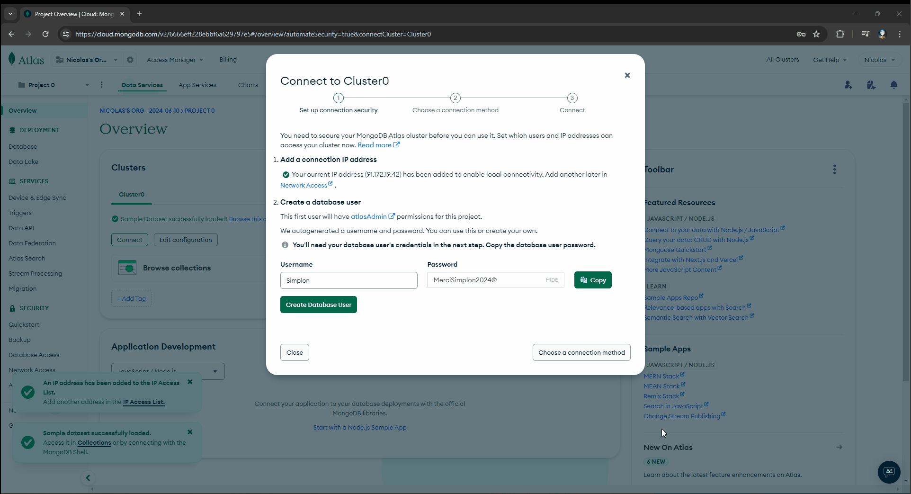
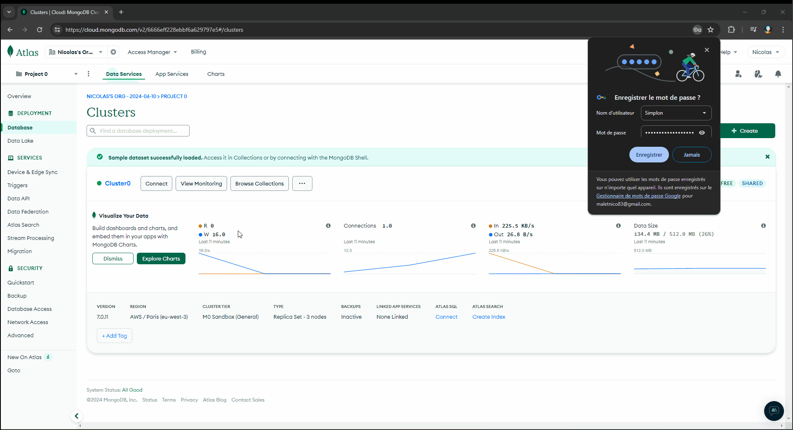
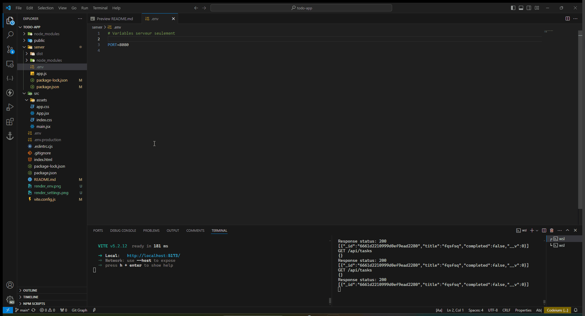
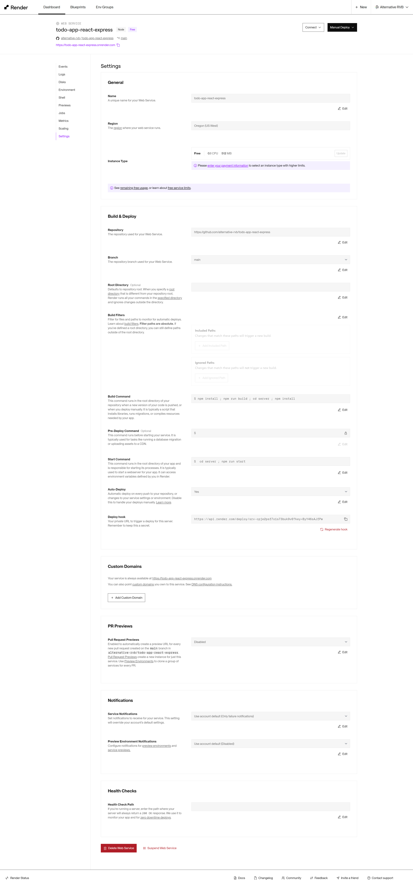
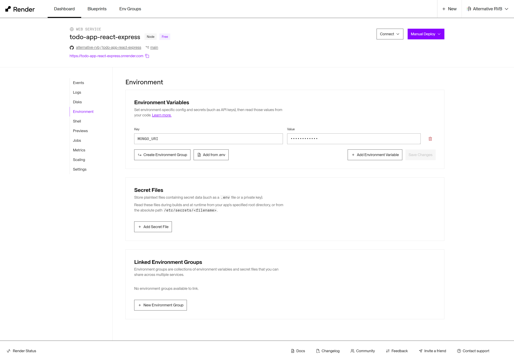

# Tutorial : Créer une TODO app avec Express JS, React JS et MongoDB Atlas

[[TOC]]

## Installer React JS avec Express JS comme back-end

Ce tutoriel va vous permettre de créer une TODO app avec Express JS, React JS et MongoDB Atlas en évitant les problèmes de cors

- Express sur le port 8080
- React sur le port 3000

```bash
npx create-vite todo-app --template react
```

A noter que `npm run build` crée un dossier `dist/` qui contient le code compilé et les fichiers statiques qui sont dans le dossier `public/`.

Créer un dossier `server/` qui contiendra le code de l'API (back-end ExpressJS) et se placer dans le dossier.

```bash
mkdir server
cd server
touch package.json
```

Créer dans le dossier `server/` le fichier package.json avec ce contenu `{}`

Puis installer les modules suivants

```bash
npm i express
```

Créer les fichers `server/app.js` et `server/.env`  et insérer les lignes code suivant :

```js
// server/app.js
const express = require("express");
const app = express();

const PORT = process.env.PORT || 8080;

app.listen(PORT, () => {
  console.log(`Server started on port: ${PORT}\nvia http://localhost:8080`);
});
```

```bash
# server/.env
PORT=8080
```

Tester le server avec la commande

```bash
node app
```

Installer `nodemon`
npm i nodemon -g
``

Tester le server avec `nodemon`

```bash
nodemon app.js
```

Dans `server/app.js` ajouter les lignes suivantes et tester le resultat sur le navigateur:

```js
// Database

const todos = [
  {
    id: 1,
    title: "Buy milk",
    completed: false,
  },
  {
    id: 2,
    title: "Buy eggs",
    completed: false,
  },
  {
    id: 3,
    title: "Buy bread",
    completed: false,
  },
];

app.get("/api/tasks", (req, res) => {
  // Express converts the todos array to JSON and sends it back to the client
  res.send(todos);
});
```

Le serveur devrait retourner les tâches du tableau `todos`.

Maintenant on va tenter de `fetch` les données dans React:

```js
import { useState, useEffect } from "react";
function App() {

  const [tasks, setTasks] = useState([]);

  useEffect(() => {
      fetch("/api/tasks")
        .then((res) => res.json())
        .then((data) => {
          setTasks(data);
        })

  }, []);

  function renderTasks() {
    return tasks.map((task) => {
      return <li key={task.id}>{task.title}</li>;
    });
  }

  return (
    <main>
      <h1>Hello</h1>
      {renderTasks()}
    </main>
  );
}

export default App;
```

Lancer le server de react `npm run dev`

> ⚠️ A ce stade React ecoute le port 5173 et le server envoie les données sur le port 8080 et cela produira une erreur...

Lancer la commande `npm run build`

Deplacer le dossier `dist` ( ou `build`) généré par react vers le dossier de server ExpressJS `server/dist/`

Insérer les lignes suivantes dans le fichier `server/app.js` pour servir le dossier `dist` via le serveur ExpressJS `server/`

```js
const express = require("express");
const app = express();

const PORT = process.env.PORT || 8080;

app.listen(PORT, () => {
  console.log(`Server started on port: ${PORT}\nvia http://localhost:8080`);
});

// Servir les fichiers statiques de l'application React build
app.use(express.static("dist"));

// Database

const todos = [
  {
    id: 1,
    title: "Buy milk",
    completed: false,
  },
  {
    id: 2,
    title: "Buy eggs",
    completed: false,
  },
  {
    id: 3,
    title: "Buy bread",
    completed: false,
  },
];

app.get("/api/tasks", (req, res) => {
  // Express converts the todos array to JSON and sends it back to the client
  res.send(todos);
});
```

Express servira le dossier `dist` de react et alors la fonction `fetch` retournera les donnees de l'API car les fichiers s'executeront sur le meme serveur avec le port `8080`

Dans le dossier `server/` lancer la commande `node app` et tester `http://localhost:8080/api/tasks`

Maintenant ajouter les lignes suivantes dans `server/package.js`

```js
"scripts": {
    "start": "node app"
  },
```

✅ Ce sera la commande pour mettre le site en production

Maintenant pour la version de développement, on va ajouter le code suivant dans `vite.config.js` de react :

```js
import { defineConfig } from "vite";
import react from "@vitejs/plugin-react";
import { resolve } from "path";

// https://vitejs.dev/config/
export default defineConfig({
  plugins: [react()],
  build: {
    // Chemin où les fichiers de production seront générés
    outDir: resolve(__dirname, "./server/dist"),
  },
  server: {
    proxy: {
      // toutes les requêtes commençant par '/api' seront transférées à 'http://localhost:8080'
      "/api": "http://localhost:8080",
    },
  },
});
```

Cela redirigera les requêtes `/api` de react vers le serveur expressJS `server` avec le port `8080`

Maintenant vous pouvez lancer react avec la commande `npm run dev`
et le serveur ExpressJS dans `server/` avec la commande `npm run dev`

Au final `server/package.json` contiendra:

```json
  "scripts": {
    "start": "node app",
    "dev": "nodemon app"
  }
```

Tester `http://localhost:8080/`, vous devriez voir les tâches qui sont affichées

### Créer la base de données MongoDB Atlas

Dans cette partie on va utiliser MongoDB Atlas pour créer la base de données de l'application et crée une collection de tâches.








## Enregistrement des tâches dans la base de données MongoDB

- Apprendre les commandes MongoDB (requêtes) pour ajouter des tâches à la base de données MongoDB : <https://youtu.be/ofme2o29ngU?si=71NwVst-yrlySdRV>
- Opérations de CRUD avec MongoDB et Express : <https://youtu.be/ObkVmnr8B9k?si=_-eZJYsHxo0-Yabm>

## Application Complète

Commencer par installer MongoDB et dotenv sur le serveur.

Maintenant essayer de gérer les tâches dans l'application et enregistrer les tâches dans la base de données MongoDB.

```bash
npm i mongodb
npm i dotenv
```

### Ajouter le code de l'API dans le fichier `server/app.js`

```javascript
const express = require("express");
const { MongoClient, ObjectId } = require("mongodb");
const dotenv = require("dotenv");
const path = require("path");

const app = express();
dotenv.config();

// Middleware pour analyser les corps JSON des requêtes
app.use(express.json());

const PORT = process.env.PORT || 8080;
let db, tasksCollection;

// Connexion à MongoDB Atlas en utilisant le client natif MongoDB
MongoClient.connect(process.env.MONGO_URI)
  .then((client) => {
    console.log("Connecté à MongoDB Atlas");
    db = client.db(); // Obtenir l'objet de la base de données
    tasksCollection = db.collection("tasks"); // Accéder ou créer la collection des tâches
  })
  .catch((error) => console.error("Erreur de connexion à MongoDB:", error));

// Logger middleware pour logger chaque requête
app.use((req, res, next) => {
  console.log(`${req.method} ${req.url}`);
  console.log("↖️  req.body: ")
  console.log(req.body);
  const oldSend = res.send;
  res.send = function (data) {
    console.log( '↘️ ', `Status: ${res.statusCode}`);
    if (data) console.log(JSON.parse(data));
    oldSend.call(this, data);
  }
  next();
});

// Opérations CRUD

// GET : Récupérer toutes les tâches
app.get("/api/tasks", async (req, res) => {
  try {
    const tasks = await tasksCollection.find().toArray(); // Récupérer tous les documents
    res.json(tasks);
  } catch (error) {
    res.status(500).json({ message: "Échec de la récupération des tâches." });
  }
});

// POST : Créer une nouvelle tâche
app.post("/api/tasks", async (req, res) => {
  try {
    const newTask = req.body;
    const result = await tasksCollection.insertOne(newTask); // Insérer un nouveau document
    res.status(201).json({ ...newTask, _id: result.insertedId }); // Répondre avec la tâche créée
  } catch (error) {
    res.status(400).json({ message: "Échec de la création de la tâche." });
  }
});

// PUT : Mettre à jour une tâche par ID
app.put("/api/tasks/:id", async (req, res) => {
  try {
    const { id } = req.params;
    if (!ObjectId.isValid(id)) {
      return res.status(400).json({ message: "Format d'ID invalide" }); // Valider l'ID
    }

    const objectId = new ObjectId(id);
    const updatedTask = req.body;
    delete updatedTask._id; // Empêcher le client de changer le _id

    const result = await tasksCollection.findOneAndUpdate(
      { _id: objectId },
      { $set: updatedTask }
    );
    if (result) {
      res.json(result);  // Envoie le document mis à jour
    } else {
      res.status(404).json({ message: "Task not found" });
    }
  } catch (error) {
    console.error('Erreur lors de la mise à jour:', error);
    res.status(400).json({ message: error.message });
  }
});

// DELETE : Supprimer une tâche par ID
app.delete("/api/tasks/:id", async (req, res) => {
  try {
    const { id } = req.params;
    if (!ObjectId.isValid(id)) {
      return res.status(400).json({ message: "Format d'ID invalide" });
    }

    const objectId = new ObjectId(id);
    const result = await tasksCollection.deleteOne({ _id: objectId });
    if (result.deletedCount === 1) {
      res.status(204).send(); // Aucun contenu à renvoyer
    } else {
      res.status(404).json({ message: "Tâche non trouvée" });
    }
  } catch (error) {
    console.error('Erreur lors de la suppression:', error);
    res.status(400).json({ message: error.message });
  }
});

// Démarrer le serveur et écouter sur le port configuré
app.listen(PORT, () => {
  console.log(`Serveur démarré sur le port : ${PORT}`);
});

// Servir les fichiers statiques de l'application React
app.use(express.static("dist"));

// Rediriger toutes les autres requêtes vers index.html pour la gestion du routage côté client
app.get("*", (req, res) => {
  res.sendFile(path.resolve(__dirname, "dist", "index.html"));
});


```

### Ajouter le code dans react

```js	
// src/App.jsx
import { useState, useEffect } from "react";
import "./app.css";

// Utiliser la variable d'environnement pour l'URL de l'API
// const API_URL = process.env.VITE_API_URL;
// console.log('API_URL:', API_URL)

function App() {
  const [tasks, setTasks] = useState([]);
  const [newTask, setNewTask] = useState("");

  useEffect(() => {
    fetch(`/api/tasks`)
      .then((res) => res.json())
      .then((data) => {
        setTasks(data);
      });
  }, []);

  function handleAddTask() {
    if (!newTask) {
      alert("Please enter a task");
      return;
    }
    fetch(`/api/tasks`, {
      method: "POST",
      headers: {
        "Content-Type": "application/json",
      },
      body: JSON.stringify({ title: newTask, completed: false }),
    })
      .then((res) => res.json())
      .then((task) => {
        setTasks([...tasks, task]);
        setNewTask("");
      });
  }

  function handleToggleTask(id) {
    const task = tasks.find((task) => task._id === id);
    fetch(`/api/tasks/${id}`, {
      method: "PUT",
      headers: {
        "Content-Type": "application/json",
      },
      body: JSON.stringify({ ...task, completed: !task.completed }),
    })
      .then((res) => res.json())
      .then((updatedTask) => {
        console.log('updatedTask:', updatedTask)
        setTasks((prevTasks) => prevTasks.map((task) => (task._id === id ? { ...updatedTask, completed: !updatedTask.completed } : task)));
      });
  }

  function handleDeleteTask(id) {
    fetch(`/api/tasks/${id}`, { method: "DELETE" }).then(() => {
      setTasks(tasks.filter((task) => task._id !== id));
    });
  }

  function renderTasks() {
    return tasks.map((task) => (
      <li key={task._id} className="flex items-center gap-8">
        <span
          style={{ textDecoration: task.completed ? "line-through" : "none" }}
          onClick={() => handleToggleTask(task._id)}
          className="cursor-pointer flex-1"
        >
          {task.title}
        </span>
        <button
          onClick={() => handleDeleteTask(task._id)}
          className="cursor-pointer"
        >
          Delete
        </button>
      </li>
    ));
  }

  return (
    <main className="mw-420 m-auto p-16 flex flex-col gap-16">
      <div className="p-16 shadow rounded-16">
        <h1>Todo List</h1>
        <div className="flex items-center">
          <input
            value={newTask}
            onChange={(e) => setNewTask(e.target.value)}
            placeholder="New task"
            className="flex-1 p-8"
          />
          <button onClick={handleAddTask} className="p-8 cursor-pointer">
            Add Task
          </button>
        </div>
      </div>
      {tasks.length > 0 ? (
        <ul className="flex flex-col gap-8 p-16">{renderTasks()}</ul>
      ) : (
        <p className="p-16">No tasks yet</p>
      )}
    </main>
  );
}

export default App;

```

❗ Vérifier  `server/package.json` pour voir si les modules sont installés.

```json
{
  "scripts": {
    "start": "node app",
    "dev": "nodemon app"
  },
  "dependencies": {
    "dotenv": "^16.4.5",
    "express": "^4.19.2",
    "mongodb": "^6.7.0"
  }
}

```

On utilisera la commande `npm run start` pour lancer le serveur en production et la commande `npm run dev` pour lancer le serveur en développement.

## Déployer votre application avec Render

Rendez-vous sur [Render](https://render.com/) : <https://render.com/>

1. Vous pouvez créer un compte rapidement en vous connectant avec les identifiants de votre compte GitHub
2. Choisissez +New > Web Service
3. Nommez votre projet et configuer les commandes nessaisaires pour deployer votre application.
    - Build Command: `npm install ; npm run build ; cd server ; npm install`
    - Start Command: `cd server ; npm run start`






## Déployer votre application avec ALWAYSDATA

https://blog.alwaysdata.com/fr/2018/02/05/deployer-sans-peine-avec-git-hooks/

## Déployer votre application frontend avec Vercel

A venir

## Déployer votre application frontend avec Netlify

A venir
